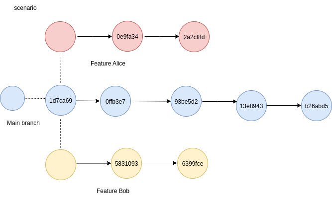
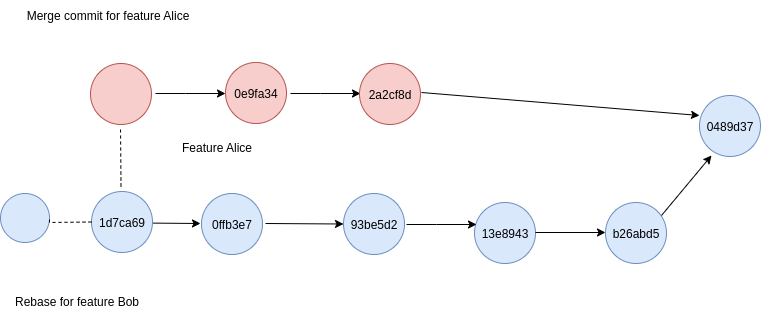
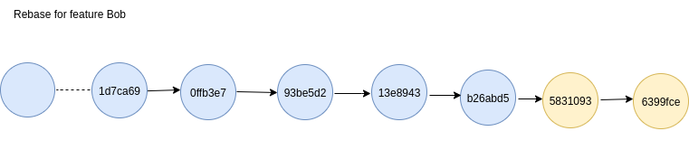

# Problem Statement: Git Merge vs. Rebase Demo

This demonstration is designed to showcase the fundamental differences between merging and rebasing a Git branch. We'll simulate a common development scenario to observe how each strategy affects the project's commit history.

## Scenario

You've created a repository called git_merge_vs_rebase.

**Initial Setup**: The main branch (shown in blue) starts with several commits. Two developers, Alice (red) and Bob (yellow), each create their own feature branches—`feature/alice` and `feature/bob`—from an earlier commit on main. They independently add unique commits to their respective branches.

**Divergence**: While Alice and Bob work on their feature branches, new commits are added to the main branch. This creates three separate lines of development: main, feature/alice, and feature/bob, each with unique changes.

## Tasks

Your goal is to integrate both feature branches back into main using two different methods and then analyze the resulting commit graphs.

For `feature/alice`: Use a merge commit (git merge) to bring the changes into main. Observe how this creates a new commit that explicitly shows the two branches being joined.

For `feature/bob`: Use a rebase (git rebase) to apply its changes on top of main's history, followed by a fast-forward merge. Observe how this creates a linear, cleaner history by essentially rewriting the `feature/bob` commits.

## Git Merge Example: Integrating feature/alice

- Merging `feature/alice` (red) into `main` (blue) creates a new merge commit (`0489d37`) (blue).
- The merge commit has two parents:  
    - Tip of `main` (`b26abd5`, blue)  
    - Tip of `feature/alice` (`2ac2cf8d`, red)
- The commit graph displays a branching structure, clearly showing where the feature branch (red) diverged and was integrated into main (blue).

**Result:**  

- Git creates a merge commit that joins the histories of both branches.
- The merge commit has two parents: one from `main` and one from `feature/alice`.
- The commit graph displays a branching structure, showing where the feature branch diverged and was integrated.
- This method preserves the context of parallel development and marks the integration point.
- The diagram visually illustrates this branching and merging process.

## Git Merge

Git Merge is a command used to combine the changes from two branches into one. It integrates work from different branches into a single unified history without losing progress. For example, you can merge a feature branch into the main branch to include all recent updates.

- **Preserves History**: Keeps the commit history of both branches.

- **Automatic and Manual**: Automatically merges unless there are conflicts.
- **Fast-Forward Merge**: Moves the branch pointer forward if no diverging changes exist.
- **Merge Commit**: Creates a special commit to combine histories.
- **No Deletion**: Branches remain intact after merging.
**Used for Integration**: Commonly integrates feature branches into main branches.

## Git Rebase Example: Integrating feature/bob

- Rebasing `feature/bob` (yellow) onto `main` (blue) rewrites the history of `feature/bob` so its commits appear after the latest commit on `main`.
- The commits from `feature/bob` (`581093`, `6399fce`, yellow) are reapplied on top of `main`'s tip (`b26abd5`, blue).
- The commit graph becomes linear, with no merge commit or branching structure.
- After rebasing, a fast-forward merge moves the `main` branch pointer forward to include the rebased commits.
- The history appears as if `feature/bob` was developed after the latest changes on `main`, making the project history cleaner and easier to follow.
- The diagram below visually illustrates this linear progression, with all commits in a single line.

**Result:**  

- Git rebase rewrites the feature branch's commits onto the tip of `main`.
- No merge commit is created; the history is linear.
- The commit graph shows a straight line, with no branching.
- This method simplifies the commit history and makes it easier to understand.
- The diagram highlights the absence of a merge commit and the linear integration of changes.

## Git Rebase

Git Rebase is a command used to move or combine a sequence of commits to a new base commit. It rewrites commit history to create a linear progression of changes.

- **Rewrites History:** Moves commits to a new base, creating a cleaner, linear history.
- **No Merge Commits:** Avoids unnecessary merge commits, keeping the log tidy.
- **Interactive Option:** Allows editing, squashing, or reordering commits.
- **Cleaner Commit Graph:** Ideal for maintaining readable project history.
- **Requires Caution:** Should not rebase public/shared branches.
- **Used for Streamlining**: Commonly rebases feature branches onto updated main branches.

## Git Merge V/s Rebase

| Git Merge                                                | Git Rebase                                                   |
|----------------------------------------------------------|--------------------------------------------------------------|
| Combines changes from one branch into another with a merge commit. | Applies commits from one branch onto another by rewriting history. |
| Preserves the complete commit history.                   | Creates a linear history by removing merge commits.          |
| Useful for integrating feature branches.                 | Ideal for a clean, simplified project history.               |
| Does not alter existing commits.                         | Rewrites commit hashes and order.                            |
